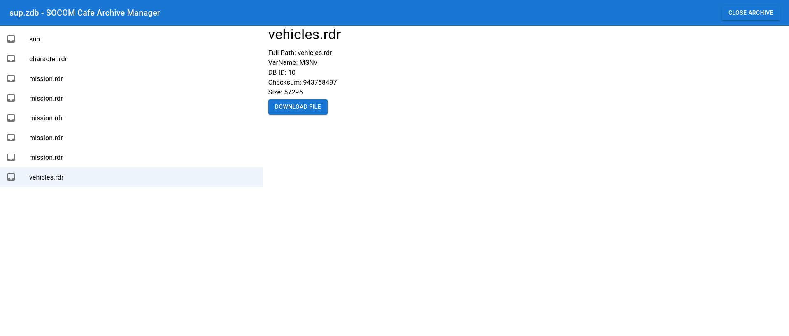

# SOCOM Archive Manager

Assists with editing SOCOM ZDB and ZAR archives.

This app is a port of the original project to React, 
so it can be platform independent and ran on the web.
This project is still under heavy development.

Develop with `npm start`

Build with `npm run build`

All original works are credit of [mbacker80](https://github.com/mbacker80).

The original repository is located at [SOCOM-Archives-Manager](https://github.com/mbacker80/SOCOM-Archives-Manager).

